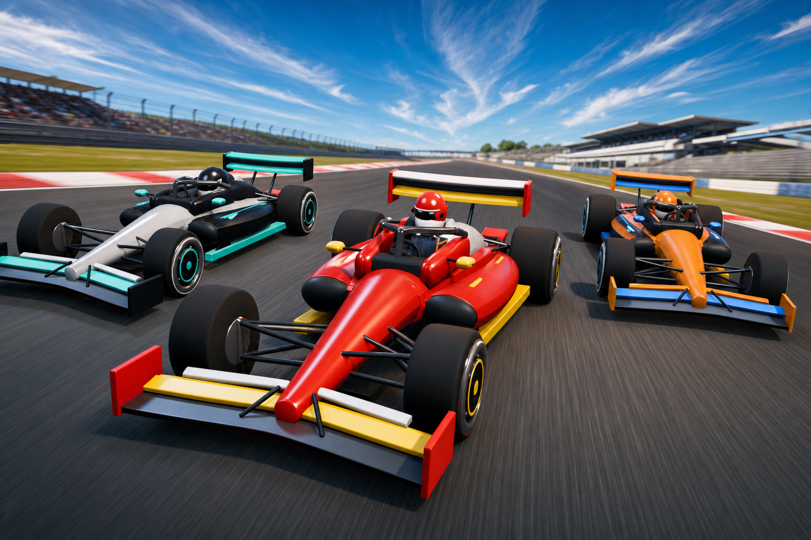

# Formula Forge



## Prerequisites + Quick setup

Formula Forge currently targets Linux. To build it, you need:

- A C++20 compiler such as `g++`
- CMake 3.20 or newer
- GNU Make
- X11 or Xwayland with EGL/OpenGL ES runtime libraries
- A gamepad or steering wheel for gameplay

SDL3 and raylib source archives are pinned under `third_party/` and build
automatically, so neither library needs to be installed system-wide.

```sh
git clone https://github.com/Vineet-Vinod/Formula-Forge.git
cd Formula-Forge
make
make run
```

The executable is written to `build/game/formula_forge`. Run it from the
repository root so it can find `assets/`. The game starts fullscreen; use the
following command for a windowed session:

```sh
make run ARGS="--windowed"
```

Python 3.11, [`uv`](https://docs.astral.sh/uv/), and the pinned `bpy` package
are only required when regenerating or validating Blender assets.

## How Codex and GPT-5.6 were used

GPT-5.6 Sol High was an active engineering partner throughout Formula Forge.
It helped implement and iterate on the physics, AI, race rules, renderer, 
interface, controller support, procedural audio, Blender assets, tests,
and development tools.

The most useful workflow paired subjective playtesting with programmatic
feedback. After playing a build, feedback such as “the car feels slow” or “the
AI enters this corner badly” could be turned into a measurable engineering
problem. Deterministic audits then checked acceleration, braking, grip,
shifting, collisions, lap validity, track limits, and circuit-specific AI pace
before another change was accepted.

A persistent JSONL [agent-play protocol](docs/agent_play_protocol.md) lets a
model navigate menus, drive deterministic simulation frames, inspect telemetry,
and request screenshots. Codex also uses Blender through Python to generate and
validate cars, drivers, tracks, garage scenes, and runtime assets. These tools
gave the agent a closed feedback loop: build, observe, measure, change, and
verify.

## What is this

Formula Forge is an original, open-source, Linux-native 3D formula racing game
written in C++ with SDL3 and raylib. It supports full-grid races against AI
and solo Time Trial sessions across five real-world-inspired circuits.

The project combines an arcade-accessible driving model with formula-specific
behavior: tire grip, aerodynamic downforce and drag, load transfer, trail
braking, engine braking, surface changes, speed-sensitive steering, and an
eight-speed manual sequential gearbox. A complete in-game flow covers loading,
session and car selection, circuit and race-distance selection, racing, pause,
results, replay, and returning home.

## Inspiration

Formula Forge began with two interests: the approachable racing of Beach Buggy
Racing and the speed and racecraft of F1. Beach Buggy Racing is not
available natively on Linux, so the project became an experiment in
building an original Linux racing game instead. With OpenAI Build Week, it
became a broader challenge: how far could an AI coding agent help take
a 3D game when it was given ways to build, observe, measure, and verify its own
work?

## Features

### Racing

- Spa, Suzuka, Silverstone, Monza, and Interlagos-inspired circuits with
  authored elevation, track limits, runoff, and barriers
- Five logo-free car liveries sharing one Blender-authored formula car and
  driver specification
- Six-car races and solo infinite-lap Time Trial sessions
- Selectable 2, 5, 10, or infinite-lap race distances
- Ordered checkpoints, shortcut-resistant laps, wrong-way detection, finish
  order, lap timing, and checkpoint recovery
- Formula-aware AI that reads upcoming curvature, brakes before turn-in,
  commits to corner exits, attempts passes, maintains safe following gaps, and
  adapts modestly to the player's pace
- A fixed broadcast T-cam, responsive HUD, garage and loading scenes,
  procedural vehicle audio, particles, dust, brake lights, and body motion

### Controls

Formula Forge is designed for gamepads and steering wheels.

- Left stick, D-pad, or wheel rim: steer and navigate menus
- RT or accelerator pedal: accelerate
- LT, B/Circle, or brake pedal: brake; hold at low speed to reverse
- RB/right paddle and LB/left paddle: shift up and down
- A/Cross: confirm
- B/Circle: go back
- Start: pause
- Back/Select: resume or reset to the last checkpoint
- Start + Back/Select: quit

### Reproducible testing

The repository includes deterministic audits for handling, race rules,
collisions, track geometry, assets, rendering performance, and AI pace on every
circuit. The Monza AI audit is calibrated around a 75-second player lap.

```sh
make test
```

For a focused diagnostic, pass the executable's options through `make run`:

```sh
make run ARGS="--race-audit"
make run ARGS="--handling-audit"
make run ARGS="--track-catalog-audit"
make run ARGS="--ai-pace-audit-spa"
```

### Blender asset pipeline

Cars, the driver, circuits, garage, and loading artwork are produced through a
reproducible Blender Python pipeline. Editable `.blend` files, runtime `.glb`
exports, previews, and metadata live under `assets/`.

```sh
uv sync --frozen
make assets-validate
```

The validators check dimensions, materials, animations, mesh budgets, circuit
geometry, landmark order, and clearances. See the
[asset pipeline guide](tools/README.md) and
[track guide](tools/blender/tracks/README.md) before changing generated assets.

## Future work

- Add more circuits and expand the variety of track environments
- Improve artwork, lighting, effects, and sound
- Deepen AI racecraft and on-track interactions
- Add more cars, customization, and session options
- Explore Windows and macOS support

I am not accepting PR contributions at the moment. However, please open issues
for any bugs!
